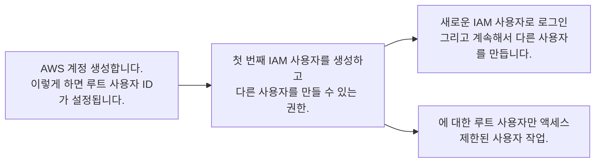

# 1. AWS 루트(Root) 사용자 보호
모든 계정에 대한 액세스를 구성할 때 인증과 권한 부여라는 두 가지 용어가 자주 표시됩니다. 이러한 용어는 기본적으로 보일 수 있지만 AWS에서 액세스 관리를 적절하게 구성하려면 완전히 이해해야 합니다.
 

### 인증
인증은 사용자가 자신이 말하는 사람이 되도록 보장합니다. 사용자 이름과 암호는 가장 일반적인 인증 유형이지만 토큰 기반 인증이나 지문과 같은 생체 데이터와 같은 다른 형식으로도 작업할 수 있습니다. 인증은 단순히 "당신이 말하는 사람입니까?"라는 질문에 답합니다.
 

### 권한 부여
권한 부여는 사용자에게 AWS 리소스 및 서비스에 액세스할 수 있는 권한을 부여하는 프로세스입니다. 권한 부여는 사용자가 리소스 읽기, 편집, 삭제 또는 생성과 같은 특정 작업을 수행할 수 있는지 여부를 결정합니다. 인증은 "어떤 작업을 수행할 수 있습니까?"라는 질문에 답합니다.
  

## AWS 루트(root) 사용자
AWS 계정을 처음 만들 때, 계정의 모든 AWS 서비스 및 리소스에 대한 완전한 액세스 권한이 있는 단일 로그인 ID로 시작합니다. 이 신원은 AWS 루트 사용자라고 불리며 계정을 만들 때 사용한 이메일 주소와 비밀번호로 로그인하여 액세스합니다.
AWS 루트 사용자에게는 두 개의 자격 증명이 연결되어 있습니다. 자격 증명 중 하나는 계정을 만드는 데 사용되는 이메일 주소와 비밀번호입니다. 이를 통해 AWS 관리 콘솔에 액세스할 수 있습니다. 두 번째 자격 증명 세트는 액세스 키라고 불리며, 이를 통해 AWS CLI(AWS 명령줄 인터페이스) 또는 AWS API에서 프로그래밍 요청을 할 수 있습니다.
액세스 키는 두 부분으로 구성됩니다.

- 액세스 키 ID (Access key ID)
- 비밀 액세스 키 (Secret access key)

사용자 이름과 암호 조합과 마찬가지로 AWS CLI 또는 AWS API를 통해 요청을 인증하려면 액세스 키 ID와 비밀 액세스 키가 모두 필요합니다. 액세스 키는 이메일 주소 및 암호와 동일한 보안으로 관리되어야 합니다.
 

  

## AWS 루트 사용자와 작업할 때의 모범 사례
루트 사용자는 청구 및 개인 정보 외에도 계정의 모든 AWS 서비스 및 리소스에 완전히 액세스할 수 있습니다. 이 때문에 루트 사용자와 관련된 자격 증명을 안전하게 잠그고 일상적인 작업에 루트 사용자를 사용하지 않아야 합니다.
루트 사용자의 안전을 보장하려면 다음 4가지의 모범 절차를 따라야 합니다.
 
1. root 사용자를 위한 강력한 암호를 설정합니다.
   - 암호 최소 길이 - 최소 6자, 최대 128자를 지정
   - 라틴 문자에서 하나 이상의 대문자 필요(A~Z)
   - 라틴 문자에서 하나 이상의 소문자 필요(a~z)
   - 1개 이상의 숫자 필수
   - 영숫자가 아닌 하나 이상의 문자 필요(! @ # $ % ^ & * ( ) _ + - = [ ] { } | ')
2. root 사용자 비밀번호나 액세스 키를 누구와도 공유하지 않습니다.
3. root 사용자와 연결된 액세스 키를 비활성화하거나 삭제합니다.
4. root 사용자를 관리 작업이나 일상적인 작업에 사용하지 않습니다.
 

## MFA(다단계 인증)
AWS 계정을 만들고 계정에 처음 로그인하면 단일 요소 인증을 사용합니다. 단일 요소 인증은 가장 간단하고 일반적인 인증 형태입니다. 하나의 인증 방법만 필요합니다. 이 경우 사용자 이름과 암호를 사용하여 AWS 루트 사용자로 인증합니다. 다른 형태의 단일 요소 인증으로는 보안 핀 또는 보안 토큰이 있습니다. MFA(다중 인증)를 사용하는 것은 원치 않는 계정 접근을 방지하는 데 중요합니다.
MFA는 신원을 확인하기 위해 두 개 이상의 인증 방법이 필요합니다. MFA는 다음 세 가지 범주의 정보를 가져옵니다.

* 사용자 이름과 비밀번호 또는 핀 번호와 같이 알고 있는 것
* 하드웨어 기기나 모바일 앱의 일회성 암호와 같이 가지고 있는 것
* 지문이나 얼굴 스캔 기술과 같은 당신의 무언가

이 추가 보안 계층은 가장 중요한 계정을 보호하는 데 도움이 될 수 있으므로 AWS 루트 사용자에서 MFA를 활성화해야 합니다.

### AWS의 MFA

MFA를 활성화하면 사용자가 일반 로그인 자격 증명 외에 지원되는 MFA 메커니즘을 사용해야 하기 때문에 추가 보안 계층이 추가됩니다. AWS 루트 사용자 계정에서 MFA를 활성화하는 것은 AWS 모범 사례입니다.

### 지원되는 MFA 기기

AWS는 가상 MFA 장치, 하드웨어 장치 및 U2F(Universal 2nd Factor) 보안 키와 같은 다양한 MFA 메커니즘을 지원합니다.

#### 가상 MFA

일회성 암호를 제공하는 휴대폰 또는 기타 기기에서 실행되는 소프트웨어 앱입니다. 이러한 응용 프로그램은 보안되지 않은 모바일 장치에서 실행할 수 있으며, 그 때문에 하드웨어 또는 U2F 장치와 동일한 수준의 보안을 제공하지 않을 수 있습니다.

**지원되는 장치**: Authy, Duo Mobile, LastPass Authenticator, Microsoft Authenticator, Google Authenticator

#### 하드웨어

일회성 6자리 숫자 코드를 생성하는 하드웨어 장치, 일반적으로 열쇠 고리 또는 디스플레이 카드 장치.

**지원되는 장치**: 열쇠 고리, 디스플레이 카드

#### U2F

컴퓨터의 USB 포트에 연결하는 하드웨어 기기입니다.

**지원되는 장치**: YubiKey
